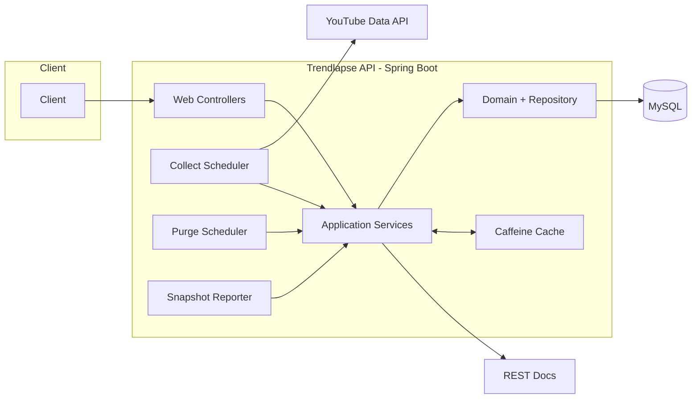

# Trendlapse API

유튜브 인기 급상승(Trending) 데이터를 주기적으로 수집하고, 시점별 랭킹/통계/리포트를 조회할 수 있는 백엔드 API 서버입니다.
수집 파이프라인(스케줄러), 검색 API, 인증, API 문서화를 하나의 서비스로 구성했습니다.

## 프로젝트 개요

- **목표**: 국가별 유튜브 트렌딩 변화를 시점 단위로 저장하고 조회 가능한 API 제공
- **핵심 도메인**: `trending video ranking snapshot`, `video`, `channel`, `region`, `member`
- **수집 방식**: 스케줄러가 YouTube Data API를 호출해 데이터 수집 후 DB에 저장
- **제공 기능**: 트렌딩/영상 검색, 회원 인증, 스냅샷 리포트 조회

## 핵심 기능

- **트렌딩 스냅샷 수집**
  - 스케줄러 기반으로 국가별 트렌딩 데이터를 주기 수집
  - 비디오/채널/스냅샷 데이터를 배치 저장
- **트렌딩 검색 API**
  - 시점, 국가, 조건 기반 트렌딩 랭킹 스냅샷 조회
  - 트렌딩 통계 정보 조회
- **비디오 검색 API**
  - 다양한 필터 조건으로 비디오 목록 검색
- **회원 인증/관리**
  - 로그인/회원 조회/회원정보 수정/회원 탈퇴
  - 세션 기반 인증 처리
- **리포트 조회**
  - 수집된 스냅샷 기반 리포트 생성/조회 API 제공
- **API 문서화**
  - Spring REST Docs + Asciidoctor 기반 문서 생성

## 아키텍처 한 장



## 기술 스택

| 구분 | 기술 |
|---|---|
| Language | Java 17 |
| Framework | Spring Boot 3.5, Spring Web, Spring Validation, Spring AOP |
| Data | Spring Data JPA, Spring Data JDBC, Querydsl |
| Database | MySQL (runtime), H2 (test) |
| Cache | Spring Cache, Caffeine |
| Async/HTTP | Spring WebFlux(WebClient), RestTemplate |
| Resilience | Spring Retry |
| Monitoring | Actuator, Micrometer Prometheus |
| AI | Spring AI OpenAI |
| Test/Docs | JUnit5, Spring REST Docs, Asciidoctor |
| Build | Gradle |

## 로컬 실행 방법

### 사전 준비

- JDK 17
- MySQL
- `src/main/resources/application-secret.yml` 파일 준비
  - 예: datasource URL/username/password, 외부 API 키(OpenAI, YouTube 등)

## 프로젝트 구조

```text
src
├─ main
│  ├─ java/io/github/hamsteak/trendlapse
│  │  ├─ channel
│  │  ├─ video
│  │  ├─ trending/video
│  │  ├─ collector
│  │  ├─ report/snapshot
│  │  ├─ region
│  │  ├─ member
│  │  ├─ youtube
│  │  └─ global
│  └─ resources
├─ test
│  ├─ java/io/github/hamsteak/trendlapse
│  └─ resources
└─ docs/asciidoc
```

- 패키지 전략: 기능 중심(package-by-feature) 구조
- `web`: 컨트롤러/요청 DTO
- `application`: 유스케이스 서비스/조회 인터페이스
- `domain`: 도메인 모델/도메인 저장소 인터페이스
- `infrastructure`: JPA/JDBC/외부 API 구현체
- `global`: 공통 설정, 에러 처리, 로깅, 캐시, 메트릭
